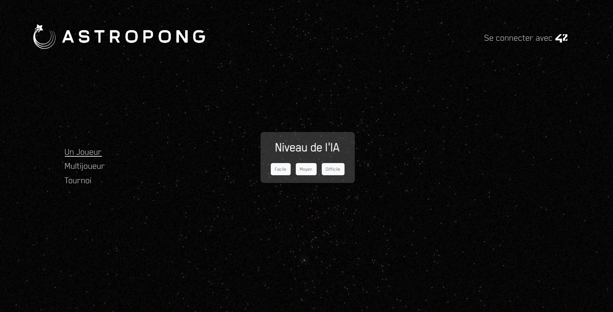

# Kubernetes Pong

A reimagined Pong game deployed on Kubernetes, featuring online multiplayer and AI opponents.


## Project Overview

This project serves as an introduction to Kubernetes by deploying a modernized version my 42School's team and I made of the classic Pong game. The application is fully containerized and deployed on a local Kubernetes cluster using Kind (Kubernetes in Docker).
All the images are hosted on my GitLab registry.

### Features

- **Multiplayer Pong**: Play against other players online or local
- **AI Opponents**: Challenge various difficulty levels of AI



### ⚠️ Login/Authentication has been disabled for this version

## Requirements

This project is designed to run on Debian/Ubuntu systems. You'll need:

- **Docker**: The cluster runs inside Docker containers
- **curl**: Used to download dependencies
- **Internet connection**: Required to pull container images
- **At least 4GB of RAM**: For running the Kubernetes cluster
- **4GB of free disk space**: For container images and cluster data

The Makefile will automatically install:
- Kind (Kubernetes in Docker)
- kubectl (Kubernetes command-line tool)

## Getting Started

### Setup

To set up the complete environment:

```bash
make all
```

This command:
1. Installs necessary dependencies (kind, kubectl)
2. Creates a local Kubernetes cluster
3. Sets up the ingress controller
4. Configures SSL certificates
5. Deploys all application services (frontend, database, auth, game, etc.)
6. Displays the access URL when ready

### Accessing the Application

Once the setup is complete, access the application at:

```
https://localhost:7777
```

**⚠️ Note**: The application works best with Google Chrome, as it handles self-signed certificates more gracefully.

### Available Commands

For a complete list of available commands:

```bash
make help
```

### Stopping the Cluster

To pause the cluster without deleting it (faster restart later):

```bash
make down
```

To resume a paused cluster:

```bash
make boot
```

### Cleanup

To remove the cluster while keeping the binaries:

```bash
make clean
```

For complete cleanup (removes cluster and all installed binaries):

```bash
make fclean
```

## Troubleshooting

If you encounter issues:

1. Check pod status: `./kubectl get pods`
2. View logs of specific services: `./kubectl logs <pod-name>`
3. Ensure Docker has enough resources allocated
4. Try restarting the setup with `make re`

## Architecture

The application consists of several microservices:
- Frontend service (UI)
- Authentication service
- Matchmaking service
- Game service
- AI service
- PostgreSQL database

All services are connected through a Kubernetes network and exposed via NGINX ingress controller.
